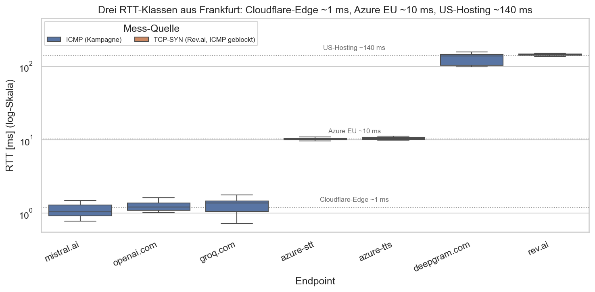
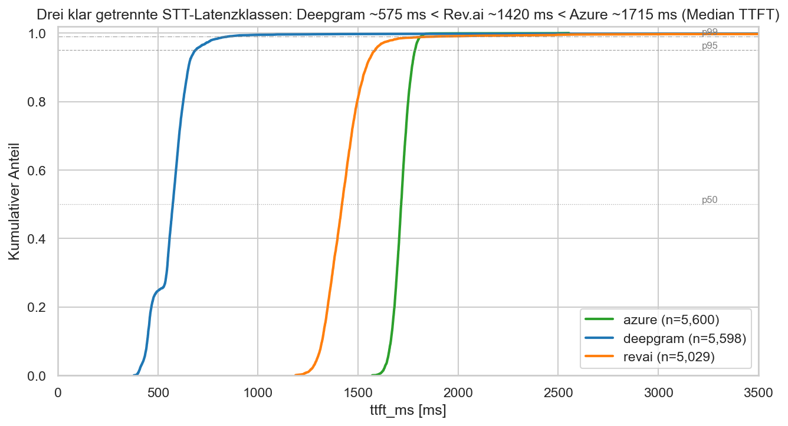
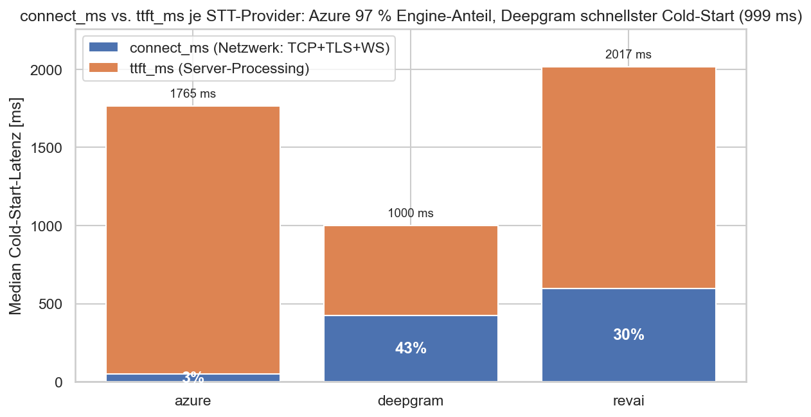
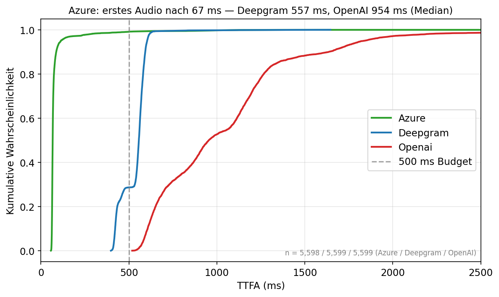
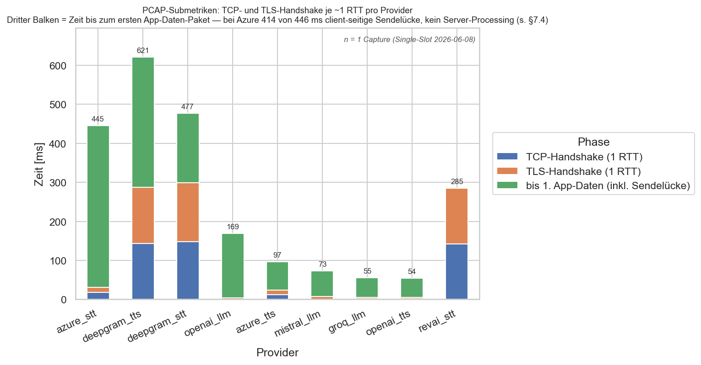
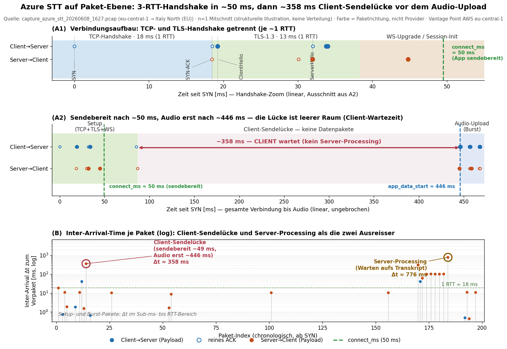
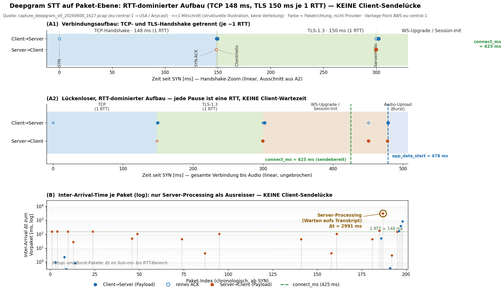
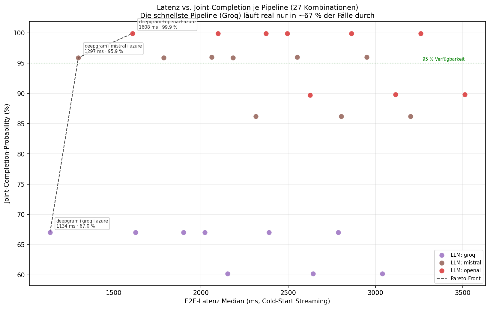

# Gespraechs-Unterlagen — Figuren mit Erklaerung

## Worum es geht

Die Arbeit misst aus EU-Perspektive (Vantage Point AWS Frankfurt, eu-central-1), in welchem Maße Netzwerk- und Infrastruktureigenschaften (RTT, Protokoll, Hosting-Region) — *im Vergleich zur Backend-Verarbeitung der Engine* — die Latenzunterschiede kommerzieller Cloud-AI-APIs (STT, LLM, TTS) erklären. Der Kernbefund lautet **„Engine schlägt Geografie"**: Aus EU-Sicht dominiert nicht die Netzwerknähe, sondern die Backend-Verarbeitung des jeweiligen Providers. Der schärfste Beleg ist die **STT/TTS-Inversion** desselben Providers Azure (EU/Italy North), der bei der Spracherkennung der langsamste, bei der Sprachsynthese aber der schnellste ist. Das ist eine Anteils-, keine Kausalaussage: Region und Engine sind je Provider konfundiert (n=1 EU-Provider pro Kategorie); die Inversion falsifiziert lediglich die Annahme, die Region erkläre die Latenz hinreichend.

## Der 30-Sekunden-Pitch (sprechbar)

Ich habe aus Frankfurt 50.400 Cold-Start-Messungen an neun kommerziellen AI-APIs gemacht, über sieben Tage, ohne NaN. Die naive Erwartung ist: je näher der Server, desto schneller — und tatsächlich sehe ich auf der reinen Netzwerkschicht drei saubere RTT-Klassen von rund einer, zehn und hundertvierzig Millisekunden. Auf der Applikationsschicht kippt diese Erwartung aber: Das US-Deepgram liefert das erste Transkript in 575 Millisekunden, das EU-nahe Azure braucht 1715. Den Beweis, dass das nicht an der Geografie liegt, liefert derselbe Azure bei der Sprachsynthese — da gewinnt er mit 67 Millisekunden. Gleiche Region, umgekehrtes Ergebnis. Heißt: aus EU-Sicht erklärt nicht die Nähe die Latenz, sondern die Backend-Verarbeitung. Die Drei-Schichten-Methodik — Ping, PCAP, API-Latenz — macht diesen Anteil von Netzwerk gegen Verarbeitung paketgenau nachprüfbar.

## Der rote Faden (Reihenfolge der Figuren als Argument)

1. **Aufbau (Figur 1):** Die reine Netzwerkschicht etabliert die naive Erwartung — drei klar getrennte RTT-Klassen (~1 / ~10 / ~140 ms). „Nah = schnell" sieht zunächst plausibel aus.
2. **Kern (Figur 2):** Auf der STT-Applikationsschicht bricht die Erwartung: Das ferne Deepgram (575 ms) schlägt das nahe Azure (1715 ms). Die Connect-Anteil-Zerlegung zeigt, dass die Differenz aus der Verarbeitung kommt, nicht aus dem Netzwerk.
3. **Beweis (Figur 3):** Die TTS-Inversion isoliert die Region als Erklärung — derselbe Azure aus derselben Region gewinnt bei TTS (67 ms). Region konstant, Ergebnis invertiert. Das falsifiziert „Region erklärt die Latenz hinreichend".
4. **Methodik I (Figur 4):** Die PCAP-Submetriken zerlegen `connect_ms` in zählbare Round-Trips und belegen, dass der scheinbare „Server"-Block bei Azure eine client-seitige Sendelücke ist.
5. **Methodik II (Figur 5):** Die paketgenaue Timeline beweist dieselbe Sendelücke Paket für Paket und zeigt, dass die Messung von `connect_ms` sauber ist.
6. **Implikation (Figur 6):** Auf die ganze Pipeline gehoben entsteht ein Zielkonflikt Latenz gegen Zuverlässigkeit — die schnellste Kombination läuft real nur in 67 % der Fälle durch, was eine differenzierte Provider-Empfehlung erzwingt.

## Die Figuren im Ueberblick

### Figur 1 — Drei RTT-Klassen: die naive Erwartung „nah = schnell"

Die reine Netzwerk-Umlaufzeit aus Frankfurt bildet drei klar getrennte Klassen — Cloudflare-Edge ~1 ms, Azure EU ~10 ms, US-Hosting ~140 ms (Deepgram 137,8 ms, Rev.ai per TCP-SYN 144,2 ms, da ICMP geblockt). Damit ist die geografische Intuition „je näher, desto schneller" etabliert, die die folgenden Figuren auf der Applikationsschicht widerlegen.

Detail: `figur_1_rtt-klassen.md`

### Figur 2 — Engine schlägt Geografie (STT)

Das ferne US-Deepgram liefert das erste Transkript im Median in 575 ms, das EU-nahe Azure in 1715 ms — rund dreimal langsamer trotz Netzwerknähe. Die gestapelte Zerlegung zeigt, dass bei Azure nur 3 % des Cold-Starts Netzwerk sind (bei Deepgram 43 %); die Differenz steckt in der Backend-Verarbeitung.

Detail: `figur_2_stt-engine.md`

### Figur 3 — Die Inversion (TTS): Derselbe Azure gewinnt

Bei der Sprachsynthese liefert derselbe Azure aus derselben Region (Italy North) das erste Audio im Median nach 67 ms — gegen Deepgram 557 ms und OpenAI 954 ms. Region konstant, Ergebnis invertiert: Das ist der Beleg, der die Region als hinreichende Erklärung falsifiziert.

Detail: `figur_3_tts-inversion.md`

### Figur 4 — connect_ms-Zerlegung: TCP/TLS-Submetriken aus dem PCAP

Die PCAP-Submetriken zerlegen den Verbindungsaufbau in zählbare Round-Trips: TCP- und TLS-Handshake sind je ~1 RTT (Deepgram 148/150 ms, Azure 18/13 ms). Der scheinbare „Server"-Block bei Azure STT (414 von 446 ms) ist überwiegend eine client-seitige Sendelücke, kein Server-Processing.

Detail: `figur_4_tcp-tls-submetriken.md`

### Figur 5 — Paket-Timeline + Inter-Arrival-Time (PCAP, Layer 2)

Die paketgenaue Timeline belegt, dass die ~358-ms-Lücke bei Azure (letztes Setup-Paket ~87 ms bis erstes Audio ~446 ms) eine Client-Wartezeit ist, kein Server-Processing — die App ist bereits bei `connect_ms` ~49 ms sendebereit. Deepgram hat keine solche Lücke; seine Vor-Audio-Zeit ist der RTT-dominierte 3-RTT-Handshake.

Detail: `figur_5_paket-timeline.md`

### Figur 6 — Latenz vs. Zuverlässigkeit der E2E-Pipeline

Über alle 27 Pipeline-Kombinationen (3 STT × 3 LLM × 3 TTS) zeigt sich ein Zielkonflikt: Die latenzschnellste Pipeline (deepgram+groq+azure, 1134 ms) läuft real nur in ~67 % der Fälle durch, während die zuverlässigste (deepgram+openai+azure, 99,9 %) 1608 ms braucht. Die Zuverlässigkeit hängt fast vollständig an der LLM-Komponente.

Detail: `figur_6_latenz-vs-verfuegbarkeit.md`

## Die wichtigsten Zahlen auf einen Blick

| Größe | Wert | Quelle/Figur |
|---|---|---|
| RTT-Klassen (Median) | Cloudflare ~1 ms · Azure EU ~10 ms · US ~140 ms | F1 |
| STT-TTFT Median (connect-exklusiv) | Deepgram 575 · Rev.ai 1420 · Azure 1715 ms | F2 |
| STT-connect Median | Deepgram 425 · Rev.ai 598 · Azure 50 ms | F2/F4 |
| STT-connect-Anteil am Cold-Start | Deepgram 43 % · Rev.ai 30 % · Azure 3 % | F2 |
| STT-Zerlegung Azure vs. Deepgram | Netz −375 ms · Verarbeitung +1140 ms · netto +765 ms | F2 |
| TTS-TTFA Median (connect-inklusiv) | Azure 67 · Deepgram 557 · OpenAI 954 ms | F3 |
| LLM-TTFT Median | Groq 68 · Mistral 231 · OpenAI 542 ms | F6 |
| PCAP TCP/TLS-HS (je ~1 RTT) | Deepgram 148/150 ms · Azure 18/13 ms | F4/F5 |
| Azure Client-Sendelücke (PCAP) | ~358 ms (≠ Server-Processing) | F4/F5 |
| Azure Server-Processing (PCAP) | ~776 ms · Deepgram ~2991 ms | F5 |
| TLS-1.2-Penalty (Rev.ai connect) | ~153 ms | F4 |
| E2E beste Kombi (Latenz/JCP) | deepgram+groq+azure 1134 ms / 67 % | F6 |
| E2E Mistral-Kombi | deepgram+mistral+azure 1297 ms / 95,9 % | F6 |
| E2E zuverlässigste Kombi | deepgram+openai+azure 1608 ms / 99,9 % | F6 |
| Cold-Start < 1000 ms | 0/27 Kombinationen; Monte-Carlo p95 ~1350 ms | F6 |
| Datenbasis | 50.400 Messungen, 7 Tage, 0 % NaN | gesamt |

## Ehrliche Limitationen (mit jeweiliger Entschaerfung)

- **Region und Engine sind konfundiert (n=1 EU-Provider je Kategorie).** Die STT/TTS-Inversion falsifiziert die Hypothese „Region erklärt die Latenz hinreichend", beweist aber nicht „die Engine erklärt alles". *Entschärfung:* Als Anteils-, nicht als Kausalaussage führen; konsequent von „Backend-Verarbeitung" statt kausal von „der Engine" sprechen.
- **„56/56 ohne Überlappung" ist eine Slot-Median-Aussage.** Präzise: In allen 56 Slots liegt der Deepgram-Slot-Median unter dem Azure-Slot-Median. *Entschärfung:* Die Roh-Wertebereiche (Tails) überlappen sehr wohl — das wird in den CDFs (F2/F3) offen gezeigt, nicht als „kein einziger Lauf überlappt" verkauft.
- **Groqs 67 % ist kein i.i.d.-Zufall, sondern ein Free-Tier-Quota.** HTTP 429 nach ~67 Erfolgen pro Slot ist deterministisch. *Entschärfung:* Die Joint-Completion-Probability wird als obere Schranke / Tarif-Artefakt gekennzeichnet, nicht als exakte Per-Request-Wahrscheinlichkeit.
- **Mediane sind nicht additiv (E2E-Summe).** Die x-Achse von F6 addiert Komponenten-Mediane. *Entschärfung:* Eine Monte-Carlo-Faltung der empirischen Verteilungen (median-of-sum, p90/p95) flankiert die Summe; sie ergibt p95 ~1350 ms und zeigt, dass nur ~24 % der Einzelläufe der besten Kombi unter 1 s liegen.
- **Cross-Layer-Modell mit n=4.** `connect_ms ≈ N_RTTs × ping + k` gilt nur für die vier direkten Provider (slope ~1). *Entschärfung:* Bewusst als Methoden-Baustein, nicht als Schlagzeile geführt; r wird nicht als Gütemaß verkauft. Bei Cloudflare-Providern (4/9) misst `connect_ms` den Edge, nicht das Backend — Grenze offen benannt.
- **PCAP-Submetriken mit n=1 Capture je Provider.** Single-Slot 2026-06-08. *Entschärfung:* Sie sind Mechanismus-Beleg, nicht Verteilung; die abgeleiteten Werte (TCP/TLS je ~1 RTT, connect_ms) decken sich mit den n>5000 Layer-3-Medianen.
- **Vantage-Point-Caveat.** Die Juni-L3-Kampagne lief auf einem anderen AWS-Account (eu-central-1). *Entschärfung:* Nur Deepgram (Anycast) weicht messbar ab; eine EC2-Validierung (i-045) reproduziert L1/TLS/connect_ms.

## Drei Fragen, die der Prof sicher stellt, + Antwort

**1. „Sie zählen den Connect doch doppelt, wenn Sie die E2E-Latenz aus den Komponenten addieren?"**
Nein. Es gibt eine Metrik-Asymmetrie. Die STT-TTFT ist connect-*exklusiv*: sie wird ab dem ersten gesendeten Audio-Chunk gemessen, also nach dem Verbindungsaufbau (im Code `t_first_final − t_first_chunk`). Deshalb wird der STT-Connect separat aufaddiert. LLM-TTFT und TTS-TTFA sind dagegen connect-*inklusiv* — ihr eigener Verbindungsaufbau steckt bereits im Wert. Die Summe `stt_connect + stt_ttft + llm_ttft + tts_ttfa` zählt den Connect deshalb genau einmal, nicht doppelt.

**2. „Wenn Azures ‚Server'-Block 414 ms ist — heißt das nicht, dass Azures STT-Backend langsam ist?"**
Nicht in `connect_ms`. Die PCAP-Analyse (F4/F5) zeigt: Azure ist bei `connect_ms` ~49 ms bereits sendebereit, schickt das Audio aber erst bei ~446 ms los. Diese ~358-ms-Lücke ist eine client-seitige Sendelücke meines Mess-Clients, kein Server-Processing — `app_data_start` (446 ms) ist nicht `connect_ms` (49 ms). Azures *Verarbeitung* ist getrennt sichtbar (~776 ms im PCAP) und steckt im TTFT, nicht im Connect. Bei Deepgram gibt es keine solche Lücke; dort ist die Vor-Audio-Zeit schlicht der 3-RTT-Handshake.

**3. „Ist ‚Engine schlägt Geografie' bei n=1 EU-Provider je Kategorie nicht überinterpretiert?"**
Berechtigt — deshalb ist es eine Anteils-, keine Kausalaussage. Region und Engine sind je Provider konfundiert; ich behaupte nicht „die Engine erklärt alles". Was die Daten leisten, ist eine *Falsifikation*: Die STT/TTS-Inversion desselben Azure aus derselben Region zeigt, dass die Region die Latenz nicht hinreichend erklärt — sonst müsste Azure in beiden Kategorien gleich abschneiden. Deshalb spreche ich konsequent von „Backend-Verarbeitung" statt kausal von „der Engine".
